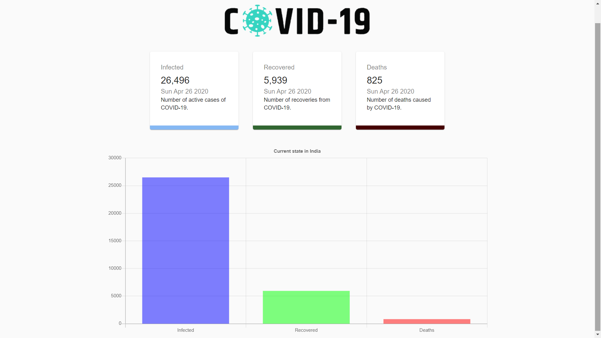

## Covid19 React Application
The purpose of building the project was to build a website to visualize the data about covid19 patients in India.


## Tech/framework used
- ReactJS
- Rest APIs
- HTML
- CSS
- Axios

## Setup:
To run this project in your local machine - 
- Clone the github repository in your local system.
- run ```npm i && npm start``` in the root project folder.

# Live 
Check Live App Here : https://covid19indiafights.herokuapp.com/
API used: 

## API Reference
I have used the following API for the data:
- https://covid19.mathdro.id/api

## Screenshot



## License
MIT © [Kushal Agrawal]()
